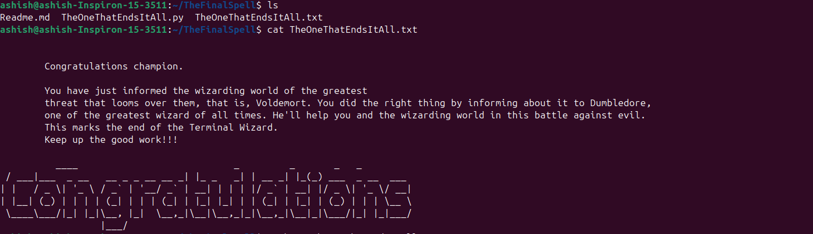

this task has began with installing gh(Git Hub CLI) cloning the command line cup repository and now in the part 1 of task we came across a blast-ended-skrewt and for a spell to defeat
this skrewt is found in spell_05 in the directory 06(as 6 is the smallest perfect number).now we need to store the code in the spell in a .txt file by using the command ' cat >>part_
01.txt'.it is 'Impedimenta'.In the next part of the task we come across a giant spider.the spell for defeating it is stored in spell_03 in the directory 02(As germanium was the first
element to be used for making semiconductors and its atomic number is 32).it is 'Stupefy'.for the next part of the task we need to switch to the branch and the branch name is the sub
ject taught by professor lupin which is 'Defence Against the Dark Arts' using this the git checkout branch and now we have encountered an sphnix and the answer to its riddle is
'Boggart' because shape shifting creatures that spung from dark and the spell to defeat this creature is 'Riddikulus' and as this file is present in another branch to copy it to the
main branch we need to use the command 'git checkout defenseAgainstTheDarkArts spellbook/Riddikulus.py' and now we need to go the graveyard branch and now we need to search for a
spell to defeat voldemort which are hidden in commit logs.for seeing the commit logs we need to
use the command git log and now for checking the commit content we need to use the command 'git show --name-only commit id' and now as the hint is one of your spells initiated a phen
omenon that will help you to escape so and for the spell lets check the  change files commits.The spell is Priori Incantatem.we should also copy this file to main branch.now we need
to decode the final code(which is the combination of all spells) using the commmand 'echo aHR0cHM6Ly9naXRodWIuY29tL1RoZUh1bnRzbWFuNC9UaGVGaW5hbFNwZWxs | base64 --decode' and the 
decoding gives you an github link 'https://github.com/TheHuntsman4/TheFinalSpell'.the page instructs us to Clone a repository and to checkout the .txt file in it.after cloning the 
Final spell repository and the we need to take ss of content of the file 'TheOneThatEndsItAll.txt '.that how i done the task

